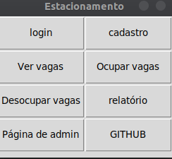

<h1 align="center">Sistema de estacionamento</h1>

Um sistema simples de estacionamento feito apenas para testes. Possui diversas funções e um sistema de login/cadastro

<h3>Tecnologias:</h3>
<ul>
    <li>Python (3.x)</li>
    <li>Tkinter</li>
</ul>

<h3>Funcionalidades: </h3>
<ul>
    <li>Cadastro de usuários</li>
    <li>Login de usuários</li>
    <li>Ocupar vagas</li>
    <li>Desocupar vagas</li>
    <li>Ver vagas disponíveis</li>
    <li>Ver histórico de ocupação/desocupação</li>
    <li>Painel de admistrador</li>
</ul>
<i>(O painel deve ser usado para definir o número de vagas e o preço por hora)<i>

